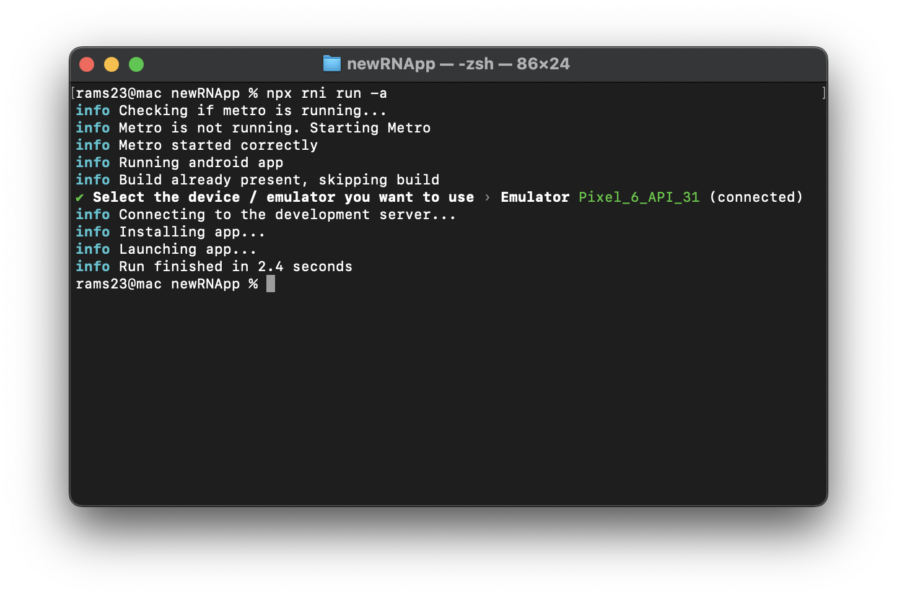

# React Native Incremental CLI

The native build of a React Native project is the slowest part of the build process. It's an expensive operation,
especially compared with the JS bundle, and it's not uncommon for it to take 5-10 minutes to complete.
But most of the time the native build is not necessary. For example, if you are only changing the JavaScript code (and
when you app reaches a stable point this is the most common situation), there is no need to rebuild the native code.
This is where this CLI tool comes in.
This project is a meant as drop in replacement fo the react-native CLI tool that caches the native build and only
rebuilds it when necessary. This can save a lot of time during development.

The release is even more expensive than the debug build. Thi cli tool can also cache the release build and only
repack it with the new JS bundle.

For now, the developers should choose if the native build should be forced or not. In the future, the cli tool may
add some heuristics to decide when to force the native build.



## Disclaimer

There are many configurations for native builds, and it's possible that this CLI does not support your
specific configuration. If you encounter any issues, please feel free to file an issue or submit a pull request.

## Credits

This project is highly inspired by the [React Native architecture articles by
Wix](https://medium.com/wix-engineering/react-native-at-wix-the-architecture-ii-deep-dive-9cfcb3c2822c) and the [related
repo](https://github.com/wix-incubator/react-native-wix-engine).

## Requirements

For more detailed information on setting up your development environment for Android and iOS, refer to the official [React Native documentation](https://reactnative.dev/docs/environment-setup).

### Android
- Java Development Kit
- Android Studio
- Android SDK
- Environment variables
  - JAVA_HOME
  - ANDROID_HOME
  - ANDROID_SDK_ROOT

### iOS
- A macOS machine with Xcode.
- CocoaPods.
- Xcode command line tools


## Installation

```bash
npm install --save-dev @xtream/react-native-incremental-cli
```

## Usage

### Run

The run command launches the app on the emulator. It will first check if the native build is present in the
cache folder. If it is, it will use it. If it is not, it will build it and then run the app.

The target device can be selected directly from the command line.

The cli handles also metro bundler. If it is not running, it will start it.

```bash
npx rn-incremental run [-a|-i] [-f|--flavor flavor] [--force-build]
```

#### Options

- `-i/--ios`: run on iOS
- `-a/--android`: run on Android
- `-f/--flavor`: specify the flavor/schema
- `--force-build`: force a native build

### Build

The build command builds the app for the specified platform. It's an explicit build, so it will
override the cache folder for the specified platform and flavor/scheme, unless the --incremental option is used.

```bash
rn-incremental build [-i/--ios] [-a/--android] [-f/--flavor] [--release] [-I/--incremental] [--force-build]
```

#### Options

- `-i/--ios`: build for iOS
- `-a/--android`: build for Android
- `-f/--flavor`: specify the flavor/schema
- `--release`: build a release version
- `-I/--incremental`: build an incremental version

## Supported features and platforms

The cli supports macOS for now. Windows support is coming soon for android.

✅ - Supported, 🚧 - In progress, ❌ - Not supported

| Feature                             | Android | iOS |
|-------------------------------------|:-------:|:---:|
| Run on emulator                     |    ✅    |  ✅  |
| Run on device                       |   🚧    | 🚧  |
| Debug build                         |    ✅    |  ✅  |
| Build flavor/schema                 |    ✅    |  ✅  |
| Release build                       |    ✅    | 🚧  |
| Incremental build                   |   🚧    | 🚧  |
| Resign of incremental build         |   🚧    | 🚧  |
| Re-versioning of incremental builds |   🚧    | 🚧  |

## How it works

### Cache folder

The CLI creates a _`.rn-incremental`_ folder in the root of the project that is used as cache for the native builds.
This is what makes the builds so fast, as it reuses the native build if it is present while running a project. You can
force a rebuild with the --force-build option.

### Incremental builds

Incremental builds are a way to speed up the release build. The idea is to reuse the native build of a previous release
and only repack it with the new JS bundle and assets.

It just executes the following steps:
* extract the native build from the previous release
* rebuild JS bundle and assets
* repack the native build with the new JS bundle and assets
* resign the app if necessary


# Who we are

A proudly 🇮🇹 software development and data science startup.<br>We consider ourselves a family of talented and passionate people building their own products and powerful solutions for our clients. Get to know us more on <a target="_blank" href="https://xtreamers.io">xtreamers.io</a> or follow us on <a target="_blank" href="https://it.linkedin.com/company/xtream-srl">LinkedIn</a>.
